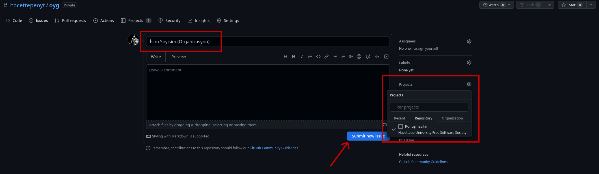

# oyg
	
Özgür Yazılım Günleri koordinasyon reposu.

## Yeni Konuşmacı Ekleme

1. Önce "Issues" sekmesine gelin:

2. "New Issue" tuşuna basın:

3. Konuşmacı bilgilerini doldurun ve "Projects" tuşuna basıp "Konuşmacılar" 'ı seçin:

4. En alttaki mavi "Submit new issue" tuşuna basın.
